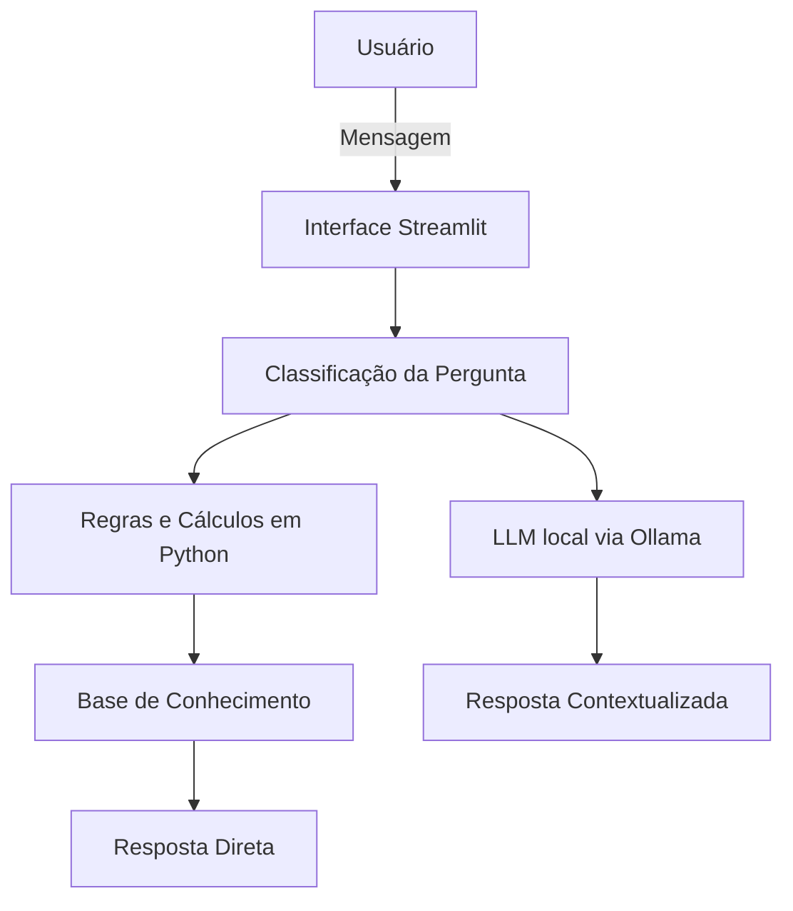

# Documentação do Agente

## Caso de Uso

### Problema
Usuários frequentemente perdem o controle de gastos mensais, adiam investimentos e têm dificuldade para transformar planejamento financeiro em ação prática. Além disso, muitos enxergam produtos seguros de investimento como algo complexo, o que leva parte da renda a ficar parada em conta corrente ou aplicada em opções pouco rentáveis.

### Solução
A Lumi é uma assistente virtual de educação financeira que apoia o usuário no controle de gastos e no acompanhamento da meta de aporte mensal. O agente utiliza dados do perfil do investidor, histórico de transações, atendimentos anteriores, produtos financeiros disponíveis e conceitos do mercado para oferecer respostas contextualizadas, seguras e objetivas.

A solução foi desenhada para:
- ajudar o usuário a acompanhar sua meta mensal de investimento
- alertar sobre o impacto de gastos não essenciais
- sugerir produtos compatíveis com o perfil do investidor
- explicar conceitos financeiros de forma simples
- realizar simulações básicas relacionadas à meta patrimonial

### Público-Alvo
Profissionais que desejam melhorar a organização financeira, controlar melhor os gastos mensais e investir com mais segurança, simplicidade e consistência.

---

## Persona e Tom de Voz

### Nome do Agente
**Lumi**

O nome foi escolhido por remeter à ideia de clareza e orientação no processo de tomada de decisão financeira.

### Personalidade
**Consultiva, educativa e encorajadora.**

A Lumi atua como uma parceira financeira digital. Seu papel não é apenas responder perguntas, mas orientar o usuário com base em dados, reforçando hábitos mais saudáveis de organização financeira e investimento.

### Tom de Comunicação
**Claro, acessível e seguro.**

A Lumi responde de forma simples e objetiva, evitando jargões desnecessários. Quando necessário, explica conceitos financeiros com linguagem didática. Em situações de incerteza, prefere admitir limitações a oferecer respostas imprecisas.

### Exemplos de Linguagem
- Saudação: "Olá! Como posso te ajudar com seus gastos, metas ou investimentos hoje?"
- Orientação: "Se você gastar esse valor agora, sua meta do mês continuará incompleta. Minha recomendação é priorizar o aporte."
- Limitação: "Não tenho dados sobre esse tema. Posso te ajudar com gastos, metas de investimento e organização financeira."

---

## Arquitetura

### Diagrama

```mermaid
flowchart TD
    A[Usuário] -->|Mensagem| B[Interface Streamlit]
    B --> C[Classificação da Pergunta]
    C --> D[Regras e Cálculos em Python]
    D --> E[Base de Conhecimento]
    E --> F[Resposta Direta]
    C --> G[LLM local via Ollama]
    G --> H[Resposta Contextualizada]
```

### Componentes

| Componente | Descrição |
|------------|-----------|
| Interface | Aplicação em Streamlit com chat interativo |
| LLM | Modelo local executado com Ollama |
| Base de Conhecimento | Arquivos JSON e CSV da pasta `data` |
| Regras de Negócio | Funções em Python para cálculos, classificação de perguntas e respostas seguras |
| Resposta | Pode ser gerada por regra ou complementada pelo LLM, dependendo do tipo de pergunta |

---

## Segurança e Anti-Alucinação

### Estratégias Adotadas
- A Lumi utiliza dados locais da pasta `data` como fonte principal de contexto.
- Perguntas sobre metas, gastos, reserva de emergência, risco e fora de escopo são respondidas por regras em Python antes de acionar o LLM.
- Cálculos de aporte, faltante da meta e projeção patrimonial são feitos diretamente no código, evitando erros matemáticos.
- O agente respeita o perfil do investidor e evita recomendar ativos incompatíveis, como criptomoedas para perfil moderado.
- Quando a informação não está disponível ou a pergunta foge do tema financeiro, a Lumi informa a limitação com clareza.
- Quando o modelo local falha, o sistema utiliza uma mensagem de fallback segura.

### Limitações Declaradas
A Lumi:
- não realiza transações financeiras
- não acessa dados bancários em tempo real
- não responde temas fora do escopo financeiro, como clima ou notícias gerais
- não substitui orientação profissional personalizada de um assessor ou planejador financeiro
- não recomenda investimentos de alto risco incompatíveis com o perfil do cliente

- não responde temas fora do escopo financeiro, como clima ou notícias gerais
- não substitui orientação profissional personalizada de um assessor ou planejador financeiro
- não recomenda investimentos de alto risco incompatíveis com o perfil do cliente
- Não faz recomendações de ativos de alto risco e sem análise de perfil.
